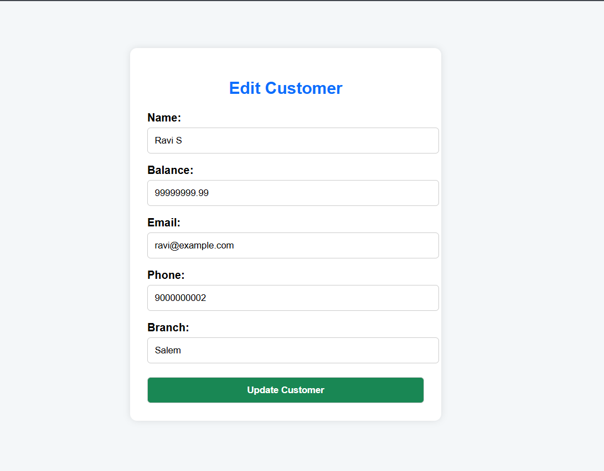

# 🏦 Bank Management System (PHP + MySQL)

A simple web-based *Bank Management System* built using *PHP, **MySQL**, **HTML**, and **CSS***.  
This system helps manage bank customers — including adding new accounts, editing customer information, deleting records, and viewing all accounts in a clean tabular format.

---

## 📁 Features

- ➕ Add / ✏ Edit / ❌ Delete Customer Records  
- 🗃 View all customers in a table with clean UI  
- 💾 MySQL database integration  
- 📸 Screenshots included  
- 🧩 Modular file structure  

---

## 🛠 Technologies Used

- ✅ PHP (Procedural)
- ✅ MySQL (via phpMyAdmin)
- ✅ HTML5 + CSS3
- ✅ XAMPP for local development

---

## 📂 Project Structure


---

## ⚙ Setup Instructions

### 🔥 Step 1: Start XAMPP
- Open the XAMPP Control Panel
- Start **Apache** and **MySQL**

### 📁 Step 2: Copy Files
- Place this project folder inside the `htdocs/` directory  
  _Example: `C:/xampp/htdocs/bank-system/`_

### 🗃 Step 3: Create Database
- Open [http://localhost/phpmyadmin](http://localhost/phpmyadmin)
- Create a new database: `bank`

### 🧱 Step 4: Create Table
- Select the `bank` database
- Run the following SQL to create the `customers` table:

```sql
CREATE TABLE customers (
  id INT AUTO_INCREMENT PRIMARY KEY,
  name VARCHAR(100) NOT NULL,
  account_no VARCHAR(50) NOT NULL UNIQUE,
  balance DECIMAL(10,2) NOT NULL,
  email VARCHAR(100),
  phone VARCHAR(15),
  branch VARCHAR(50)
);
```
## 🚀 Run the Application

Open your browser and navigate to:

- **View All Customers**: [http://localhost/bank-system/](http://localhost/bank-system/)
- **Add New Customer**: [http://localhost/bank-system/add.php](http://localhost/bank-system/add.php)

---

## 🖼 Screenshots Samples

### 📄 Customer Listing Page  


### ➕ Add New Customer  


### ✏ Edit Customer  


---

## 💾 Database Sample (JSON)

A sample JSON file `customers_data.json` is included for quick reference or migration.

---

## 📌 Notes

- Ensure `mysqli` extension is enabled in your `php.ini`
- You can import/export JSON data manually via **phpMyAdmin**
- Modify `style.css` to customize table layout, colors, and fonts

---

## 📜 License

This project is licensed under the [MIT License](LICENSE).

---

> If you'd like, I can help you:
> - ✅ Export the `.json` backup file from your MySQL data  
> - 📸 Capture screenshots for the `Screenshots/` folder  
> - 🚀 Push everything to GitHub with proper commits  
> - 🌐 Deploy it using GitHub Pages or run it on localhost


